# VRSOC Phase 00 — Route Inventory

## 1. Complete Route Catalog

Below is the complete inventory of all 32 reachable routes discovered in the Base44 application bundle and navigation hierarchy:

| Route Path | View / Feature Name | Component Symbol | Zone / Section | Primary Purpose | Reachability & Guard |
|---|---|---|---|---|---|
| `/login` | Login | `koe` | Auth | User authentication (Email/Password & Google OAuth) | Public |
| `/register` | Registration & OTP | `Foe` | Auth | User account creation & OTP verification | Public |
| `/forgot-password` | Forgot Password | `zoe` | Auth | Password reset email trigger | Public |
| `/reset-password` | Reset Password | `Uoe` | Auth | Setting new password with token query param | Public (Token required) |
| `/` | SOC Dashboard | `dNe` | Core SOC | High-level SOC situational awareness, live alerts, trends | Authenticated |
| `/agents` | Agent Management | `YNe` | Core SOC | EDR agent list, health status, telemetry stats | Authenticated |
| `/alerts` | Alert Management | `QNe` | Core SOC | Triage, filter, severity badges, alert actions | Authenticated |
| `/incidents` | Incident Response | `JNe` | Core SOC | Incident lifecycle (Detection -> Containment -> Lessons Learned) | Authenticated |
| `/detections` | Threat Detection | `eOe` | Core SOC | Detection rules engine, Sigma/YARA rules, severity scoring | Authenticated |
| `/mitre` | MITRE ATT&CK Matrix | `dOe` | Core SOC | Interactive MITRE ATT&CK tactics & techniques matrix | Authenticated |
| `/logs` | Log Explorer (SIEM) | `hOe` | Core SOC | Event logs search, timestamp filtering, raw log inspect | Authenticated |
| `/cases` | Case Management | `pOe` | Core SOC | Case creation, analyst notes, investigation timeline | Authenticated |
| `/analytics` | SOC Analytics | `vOe` | Core SOC | MTTD, MTTR, closure rates, severity breakdowns, charts | Authenticated |
| `/ai-assistant` | AI Security Assistant | `FIe` | Core SOC | Educational LLM cyber defense conversational interface | Authenticated |
| `/knowledge` | Knowledge Center | `zIe` | Core SOC | Cybersecurity educational articles, topics, and drawers | Authenticated |
| `/settings` | Platform Settings | `YIe` | Core SOC | Profile, Security, Notifications, Appearance, API keys | Authenticated |
| `/soar` | SOAR Dashboard | `sDe` | SOAR Subsystem | Orchestration overview, automated response metrics | Authenticated |
| `/soar/automation` | Automation Pipeline | `cDe` | SOAR Subsystem | Interactive 5-step alert ingestion & response pipeline runner | Authenticated |
| `/soar/playbooks` | Playbooks Directory | `dDe` | SOAR Subsystem | 20+ automated playbooks catalog, triggers, actions, run | Authenticated |
| `/soar/builder` | Visual Playbook Builder | `hDe` | SOAR Subsystem | Visual canvas node-based workflow editor for playbooks | Authenticated |
| `/soar/enrichment` | Threat Enrichment | `mDe` | SOAR Subsystem | Multi-source IP/domain/hash intelligence scanner (VirusTotal, AbuseIPDB, AlienVault) | Authenticated |
| `/soar/ai-engine` | AI Decision Engine | `yDe` | SOAR Subsystem | Dynamic risk scoring factors & automated decision tiers | Authenticated |
| `/soar/actions` | Response Actions | `vDe` | SOAR Subsystem | Catalog of containment, firewall, host, and user actions | Authenticated |
| `/soar/approvals` | SOAR Approvals | `bDe` | SOAR Subsystem | Human-in-the-loop analyst approval queue for critical actions | Authenticated |
| `/soar/cases` | SOAR Cases | `_De` | SOAR Subsystem | SOAR-generated automated cases and root cause tracking | Authenticated |
| `/soar/incident/:id`| SOAR Incident Detail | `kDe` | SOAR Subsystem | Deep investigation view for a specific incident | Authenticated |
| `/soar/history` | Execution History | `CDe` | SOAR Subsystem | Audit log of all automated playbook executions and outcomes | Authenticated |
| `/soar/live` | Live Execution | `PDe` | SOAR Subsystem | Real-time streaming log of active automated workflows | Authenticated |
| `/soar/reports` | SOAR Reports | `EDe` | SOAR Subsystem | On-demand generation of executive, incident, and technical reports | Authenticated |
| `/soar/simulation` | SOAR Simulation | `TDe` | SOAR Subsystem | Interactive attack simulator triggering automated playbooks | Authenticated |
| `/soar/settings` | SOAR Settings | `RDe` | SOAR Subsystem | Playbook automation modes (Manual/Semi/Full), approval thresholds | Authenticated |
| `*` | 404 Fallback | `aoe` | System | Not found fallback screen with navigation back to safety | Public |

---

## 2. Route Hierarchies & Layouts

```mermaid
graph TD
    App[VRSOC Application] --> AuthZone[Public Auth Routes]
    App --> Shell[Authenticated AppShell Layout]

    AuthZone --> Login["/login"]
    AuthZone --> Register["/register"]
    AuthZone --> ForgotPass["/forgot-password"]
    AuthZone --> ResetPass["/reset-password"]

    Shell --> CoreSOC[Core SOC Routes]
    Shell --> SOAR[SOAR Subsystem Routes]

    CoreSOC --> Dash["/ (Dashboard)"]
    CoreSOC --> Agents["/agents"]
    CoreSOC --> Alerts["/alerts"]
    CoreSOC --> Incidents["/incidents"]
    CoreSOC --> Detections["/detections"]
    CoreSOC --> Mitre["/mitre"]
    CoreSOC --> Logs["/logs"]
    CoreSOC --> Cases["/cases"]
    CoreSOC --> Analytics["/analytics"]
    CoreSOC --> AIAssistant["/ai-assistant"]
    CoreSOC --> Knowledge["/knowledge"]
    CoreSOC --> Settings["/settings"]

    SOAR --> SoarDash["/soar"]
    SOAR --> SoarAuto["/soar/automation"]
    SOAR --> SoarPlay["/soar/playbooks"]
    SOAR --> SoarBuild["/soar/builder"]
    SOAR --> SoarEnrich["/soar/enrichment"]
    SOAR --> SoarAI["/soar/ai-engine"]
    SOAR --> SoarAct["/soar/actions"]
    SOAR --> SoarAppr["/soar/approvals"]
    SOAR --> SoarCases["/soar/cases"]
    SOAR --> SoarIncDetail["/soar/incident/:id"]
    SOAR --> SoarHist["/soar/history"]
    SOAR --> SoarLive["/soar/live"]
    SOAR --> SoarRep["/soar/reports"]
    SOAR --> SoarSim["/soar/simulation"]
    SOAR --> SoarSet["/soar/settings"]
```

---

## 3. Query Parameter Specifications

- `/reset-password?token=<token>`: Receives cryptographic reset token.
- `/soar/incident/:id`: Dynamic parameter representing alert or incident identifier (e.g. `INC-2026-0342` or `1`).
- Filtering parameters (client-side state in Base44, target URL query params in Next.js):
  - `?category=<category>` (Knowledge Center, Threat Detection)
  - `?severity=<critical|high|medium|low>` (Alerts, Incidents)
  - `?status=<pending|approved|rejected>` (Approvals, Playbooks)
  - `?query=<search_term>` (Log Explorer, Cases, Knowledge Center)
